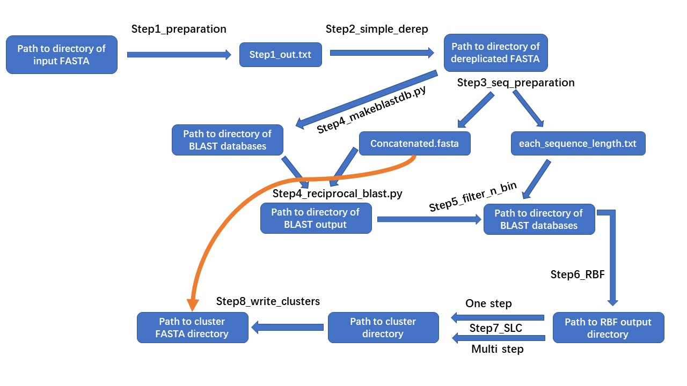

# Readme OrthoSLC (0.1.1)

**OrthoSLC** is a pipline that perfomrs Reciprocal Best Blast Hit (RBBH) Single Linkage Clustering to obtain Orthologous Genes. <br>

It is: <br>
* lightweight, fast, and convenient to install
* **independent** of relational database management systems (e.g., MySQL)
* able to handle more than 1000 genomes within hours.

The pipeline **start with annotated genomes**, and can **produce clusters of gene id, and FASTA files of each cluster**.

Note that, pipeline is recommended for sub-species level single copy core genome construction since RBBH may not work well for missions like Human-Microbe core genome construction.

**Caveat:**<br>
The pipeline is currently available for linux-like system only and have been tested on Ubuntu 20.04 and 18.04.

**Requirement:**<br>
* Python3 (suggest newest stable release or higher),<br>
* C++17 ("must" or higher for compiling) users may also directly use pre-compiled binary files.<br>
Or use `install.sh` to manually compile like following:

```Shell
$ chmod a+x install.sh
$ install.sh /path/to/src /path/to/bins
```
* NCBI Blast+ (suggest 2.12 or higher) <br>

Besides callable binary files, we also provide an "all-in-one" Jupyter notebook interface `OrthoSLC_Python_jupyter_interface.ipynb`. It is s relatively slow but fits small scale analysis and allow users to do customized analysis and modification in between pipeline steps. However, for datasets with 500 or more genomes, we still recommend using the binary files, which is mainly written in C++, for optimal performance.

The programs uses [A simple C++ Thread Pool implementation](https://github.com/progschj/ThreadPool), and sincere thanks to [its contributors](https://github.com/progschj/ThreadPool/graphs/contributors).

**Note:**<br>
For all steps, users do not need to make the output directory manually, program will do that for you.

Bug report: 
* <jingjie.chencharly@gmail.com>

**Workflow:**


## Step 1 Genome information preparation
The pipeline starts with annotated genomes in fasta format. FASTA file name require strain name and extension (e.g., `strain_A.ffn`, `strain_B.fna`, `strain_C.fasta` etc.).<br> 
Step 1 needs the **path to directory of annotated FASTA files** as input, to genereate a header less, tab separated table, in which the 
* first column is a short ID, 
* second column is the strain name, 
* third column as the absolute path. 

Users can run callable binary file `Step1_preparation` and specifying parameters like following:

```shell
Usage: Step1_preparation -i input/ -o output.txt

  -i or --input_path -------> path/to/input/directory
  -o or --output_path ------> path/to/output.tsv
  -h or --help -------------> display this information
 ```

The short ID of each genome is generated to save computational resources and storage space. Since reciprocal BLAST generates a large volume of files (millions to billions of rows if large number of genomes participated), each row contains the names of the query and subject. If the user provides input FASTA file names like:

* `GCA_900627445.1_PFR31F05_genomic.fasta`
* `GCA_021980615.1_PDT001237823.1_genomic.fasta`

and such file names become part of gene identifier instead of the short ID used in this program, additional 30 ~ 60 GB of storage will be consumed for intermediate files and even more pressure on computing memory for analysis of 1000~ genomes.

## Step 2 FASTA dereplication
Step 2 is to remove potential sequence duplication (e.g., copies of tRNA, some cds). This dereplication is equivalent to 100% clustering, to obtain single copy.<br>
Step 2 **requires the tab separated table output by Step 1 as input**, and specifying a directory for dereplicated files.

You may run `Step2_simple_derep` like this:

```Shell
Usage: Step2_simple_derep -i input_file -o output/ [options...]

  -i or --input_path -------> path/to/file/output/by/Step1
  -o or --output_path ------> path/to/output/directory
  -u or --thread_number ----> thread number, default: 1
  -h or --help -------------> display this information
```

### <font color="red">Note before next step</font>
After dereplication, users should give a careful check of **size** of dereplicated FASTA files. It is worth noting that if a FASTA file with a very low amount of sequences, getting processed together with all the rest, the final "core" clusters will be heavily affected and may bias your analysis.
    
Since the core genome construction is similar with intersection construction. <font color="red">**It is recommend to remove some very small dereplicated fasta files BEFORE NEXT STEP**, e.g., remove all dereplicated <i>E.coli </i> genomes with file size lower than 2.5MB as most should be larger than 4.0MB.</font>

## Step 3 Sequence concatenation
This step requires **path to directory of derplicated FASTA** to generate to A FASTA file Combined from all dereplicated FASTA files made in Step 2.

You may run `Step3_seq_preparation` like following:

```Shell
Usage: Step3_seq_preparation -i input/ -c concatenated.fasta

  -i or --input_path ---------> path/to/input/directory
  -c or --concatenated_fasta -> path/to/output/concatenated.fasta
  -h or --help ---------------> display this information
```

## Step 4 Pre-clustering of concatenated FASTA and non-redundant genome generation

Step 4 is the new feature in version `0.1` comparing with `0.1Beta`.It performs 100% clustering on the concatenated FASTA made in Step 3.<br>

The program of Step 4 will take the **concatenated fasta made in step3 as input**, and produce:<br>
* dereplicated concatenated FASTA
* length of each non-redundant sequence
* pre-clustered gene id
* each genome that is redundancy-removed

You may run `Step4_pre_cluster` like following:

```Shell
Usage: Step4_pre_cluster -i concatenated.fasta -d dereped.fasta -n nr_genome/ -l seq_len.txt -p pre_cluster.txt [options...]

  -i or --input_path ---------> path/to/input.FASTA
  -d or --concatenated_fasta -> path/to/output/dereplicated concatenated FASTA
  -n or --nr_genomes ---------> path/to/directory/of/output/non-reundant/genomes
  -l or --seq_len_info -------> path/to/output/sequence_length_table
  -p or --pre_cluster --------> path/to/output/pre-clustered_file
  -u or --thread_number ------> thread number, default: 1
  -h or --help ---------------> display this information
```

In previous versions, program would BLAST the concatenated FASTA against each dereplicated genome sequentially, as direct all-vs-all BLAST using concatenated FASTA would be too memory intensive to run (1~ G FASTA direct all-vs-all BLAST cost roughly 120 GB memory using `-mt_mode 1` with 36 threads). <br>

As tested, BLAST the concatenated FASTA against each genome (`-mt_mode 1` and 36 threads) could also be very time consuming:
* 500 <i>Listeria monocytogenes</i> costs > 7 hours.<br>
* 1150 <i>E. coli</i> costs > 2.7 days.<br>

However, when running the program for phylogneticlly close genmoes, there would be a high duplication level in the concatenated FASTA.<br>

As tested, the size of concatenated FASTA could be significantly reduced after dereplication:
* 500 <i>Listeria monocytogenes</i> before dereplication -> ~1.33GB, after -> ~187MB, 
* 1150 <i>E. coli</i> before dereplication -> ~5.2GB, after -> ~986MB

Besides dereplication on concatenated FASTA, this version would also use this dereplicated concatenaion to re-generate each genome without overall redundancy (non-redundant genome). Which would significantly reduce task labor.<br>

As tested, the BLAST time usage after dereplication could be significantly reduced:
* 500 <i>Listeria monocytogenes</i> before dereplication -> ~7 hours, after -> ~22 mins
* 1150 <i>E. coli</i> before dereplication -> ~2.7 days, after -> less than 5 hours

## Step 5 Reciprocal Blast

Step 5 will carry out the Reciprocal Blast using NCBI Blast. You can get it from [NCBI official](https://ftp.ncbi.nlm.nih.gov/blast/executables/blast+/LATEST/)
 
The pipeline will assist you to:<br>
1. Create databases for each of all dereplicated genomes using `makeblastdb`.
2. Using `blastn` or `blastp` to align the `dereplicated concatenated FASTA` against each of the database just made and get tabular output.

In case you have installed your blast but not exported to `$PATH`, you need to provide path to your blast binary file. You may use  `whereis blastn` or `whereis makeblastdb` to get the full path to your blast binary file.<br>


### makeblastdb
To create database to BLAST, users should provide **path to directory where all non-redundant FASTA made in Step 4 is**, and a **path to output directory where BLAST database is to store**.<br>
You may run `Step5_makeblastdb.py` like following:

```Shell
Usage: python Step5_makeblastdb.py -i input/ -o output/ [options...]

options:

 -i or --input_path ----------> path/to/input/directory
 -o or --output_path ---------> path/to/output/directory
 -c or --path_to_makeblastdb -> path/to/output/makeblastdb, default: makeblastdb
 -u or --thread_number -------> thread number, default: 1
 -t or --dbtype --------------> -dbtype <String, 'nucl', 'prot'>, default: nucl
 -h or --help ----------------> display this information
 ```
 
 ### Reciprocal Blast
 To perform reciprocal BLAST, users should provide **path to dereplicated concatenated FASTA producd by step 4**, **path to directory where databases made by `makeblastdb`**, and a **path to output directory where BLAST tabular output** is to store.<br>
 
You can run `Step5_reciprocal_blast.py` like following:

```Shell
Usage: python Step5_reciprocal_blast.py -i query.fasta -o output/ -d directory_of_dbs/ [options...]

options:

 -i or --query ---------------> path/to/concatenated.fasta
 -d or --dir_to_dbs ----------> path/to/directory/of/dbs
 -o or --output_path ---------> path/to/output/directory
 -c or --path_to_blast -------> path/to/output/blastn or blastp, default: 'blastn'
 -e or --e_value -------------> blast E value, default: 1e-5
 -u or --blast_thread_num ----> blast thread number, default: 1
 -m or --mem_eff_mode --------> using memory efficient mode or not, select from <'on' or 'off'>, default: off
 -h or --help ----------------> display this information
```

The reason to BLAST against each database sequentially rather than directly using an all-vs-all approach is to 
reduce computational overhead. This can be very useful if the task involves many genomes. For example, if you have 1000 dereplicated genomes to analyze, the total size of concatenated FASTA may reach 5-10 GB. A multi-threaded BLAST job using the `-mt_mode 1` by all-vs-all style could be too memory-intensive to run for such a large dataset.

In addition, sequentially running BLAST will produce one tabular output per database. This will be a better adaptation for the job parallelization of finding reciprocal best hits in later steps, which will apply the hash binning method.

Since version `0.1`, program allow users to choose recoprocal BLAST executed under memory efficient mode or not. Under memory efficient mode, the real-time memory usage will be much lower but **much more** time consuming.

## Step 6 query binning
This is the new feature in version `0.1`. This step is to apply hash binning to bin all presence of a query into same file to facilitate next step filtering.

You can run `Step6_query_binning` like following:

```Shell
Usage: Step6_query_binning -i input/ -o output/ [options...]

  -i or --input_path -------> path/to/input/directory
  -o or --output_path ------> path/to/output/directory
  -u or --thread_number ----> thread number, default: 1
  -L or --bin_level --------> binning level, an intger 0 < L <= 9999, default: 10
  -k or --no_lock_mode -----> select to turn no lock mode <on> or <off>, default: off
  -h or --help -------------> display this information
```

<font color="red"><b>Set bin level:</b></font><br>
According to the amount of genomes to analysze, user should provide binning level, which is to set how many bins should be used. Level $L$ should be interger within range $0 < L \le 9999$, and will generate $L$ bins. 

Suggestion is that do not set the bin level too high, especially when less than 200 genomes participated. If such amount of genomes participated analysis, bin level from 10 to 100 should work as most efficient way. 

As tested, an analysis of 30 genomes, has 30 BLAST output after step 5. 
* A bin level of 10, takes 3.5 seconds to finish, 
* a bin level of 100, takes 7 seconds to finish,
* a bin level of 1000, takes 18 seconds to finish,

<font color="red"><b>When to set a high bin level:</b></font><br>
Simply speaking, when you have really larger amount of genomes and not enough memory (e.g., more than 1000 genomes and less than 100 GB memory) <br>

The output of BLAST for 1000 genomes can reach 150 GB in size, and if the bin level is set to 10, there will be 10 bins to evenly distribute the data. On average, each bin will contain 1.5 GB of data, which may be too memory-intensive to process in step 6 (where requires approximately 1.5 GB of memory per bin). However, if the number of bins is increased to 1000, the size of each bin will be reduced to between 100-200 MB, which then facilitate step 7 parallelization.

<font color="red"><b>No lock mode:</b></font><br>
we provide **no lock mode** in all steps that apply hash binning to speed up the process. We allow users to turn off mutex lock which is to safely write into files when multi-threading. In ours tests, program can generate files without data corruption when multi-threading with no lock (data corruption were rarely observed, the possiblity of data corruption may vary between computation platform).

## Step 7 Filtering and binning

This step is to filter the blast output and to apply hash binning, in order to provide best preparation for reciprocal best find.<br>

Step 7 requires **path to directory of query binning output**, **sequence length information, pre-cluster information output by Step 4** as input.

You can run `Step7_filter_n_bin` like following:

```Shell
Usage: Step7_filter_n_bin -i input/ -o output/ -s seq_len_info.txt [options...]

  -i or --input_path -------> path/to/input/directory
  -o or --output_path ------> path/to/output/directory
  -s or --seq_len_path -----> path/to/output/seq_len_info.txt
  -p or --pre_cluster_path -> path/to/output/pre_cluster.txt
  -L or --bin_level --------> binning level, an intger 0 < L <= 9999 , default: 10
  -r or --length_limit -----> length difference limit, default: 0.3
  -k or --no_lock_mode -----> select to turn no lock mode <on> or <off>, default: off
  -u or --thread_number ----> thread number, default: 1
  -h or --help -------------> display this information
```

The pipeline will carry out following treatment to BLAST output:
1. Paralog removal: <br>
If query and subject is from same strain, the hit will be skipped, as to remove paralog.
2. Length ratio filtering:<br>
Within a hit, query length $Q$ and subject length $S$, the ratio $v$ of this 2 length

$$v = \frac{Q}{S}$$

should be within a range $r$, according to [L. Salichos et al](https://journals.plos.org/plosone/article?id=10.1371/journal.pone.0018755), $r$ is recommended to be higher than 0.3 which means the shorter sequence should not be shorter than 30% of the longer sequence:

$$r < v < \frac{1}{r}$$<br>

If above condition not met, the hit will be removed from analysis.

3. Non-best-hit removal: <br>
* Identical sequences are always regarded as best hit.
* If a query has more than 1 subject hits, only the query-subject pair with highest score will then be kept.
* if pairs are of same score, the pair whose query and subject are of more similar length will be kept.
4. Sorting and binning:<br>
For every kept hit, its query and subject will be sorted using Python or C++ built in sort algorithm. This is because in a sequential blast output file, only "<b>single direction best hit</b>" can be obtained, its "<b>reciprocal best hit</b>" only exist in other files, which poses difficulty doing "<b>repriprocal finding</b>". <br>
However, if a query $a$ and its best suject hit $b$, passed filter above, and form $(a, b)$, and in the mean time we sort its rericprocal hit $(b, a)$ from another file into $(a, b)$, then both $(a, b)$ will generate same hash value. This hashed value with last several digits will allow us to bin them into same new file. Therefore, after this binning, "<b>reciprocal finding</b>" will be turned into "<b>duplication finding</b>" within one same file.<br>

<font color="red"><b>Set bin level:</b></font><br>
According to the amount of genomes to analysze, user should provide binning level, which is to set how many bins should be used. Level $L$ should be interger within range $0 < L \le 9999$, and will generate $L$ bins. 

Suggestion is that do not set the bin level too high, especially when less than 200 genomes participated. If such amount of genomes participated analysis, bin level from 10 to 100 should work as most efficient way.

<font color="red"><b>When to set a high bin level:</b></font><br>
Simply speaking, when you have really larger amount of genomes and not enough memory (e.g., more than 1000 genomes and less than 100 GB memory) <br>

The output of BLAST for 1000 genomes can reach 200 GB in size, and if the bin level is set to 2, there will be 100 bins to evenly distribute the data. On average, each bin will contain 1.7 GB of data, which may be too memory-intensive to process in step 7, where reciprocal find is performed (which requires approximately 1.7 GB of memory per bin). However, if the number of bins is increased to 1000, the size of each bin will be reduced to between 100-200 MB, which then facilitate step 7 parallelization.

<font color="red"><b>Note:</b></font><br>
This is the one of the most computation and I/O intensive step, use the C++ based binary file to process for better efficiency.

## Step 8 Reciprocal Best find

This Step is to find reciprocal best hits. In `Step 7`, query-subject pairs had been binned into different files according to their hash value, therefore, pair $(a, b)$ and its reciprocal pair $(b, a)$ (which was sorted into $(a, b)$), will be in the same bin. Thus, a pair found twice in a bin will be reported as a reciprocal best blast pair.

In addition, Step 8 also does hash binning after a reciprocal best hit is comfirmed. Query-subject pairs will be binned by the hash value of query ID, which then put pairs with common elements into same bin to assist faster clustering in next step.

Step 8 requires **path to directory of bins output by Step 7**, and path to output directory.

You can run `Step8_RBF` like following:

```Shell
Usage: Step8_RBF -i input/ -o output/ [options...]

  -i or --input_path -------> path/to/input/directory
  -o or --output_path ------> path/to/output/directory
  -u or --thread_number ----> thread number, default: 1
  -k or --no_lock_mode -----> select to turn no lock mode <on> or <off>, default: off
  -L or --bin_level --------> binning level, an intger 0 < L <= 9999 , default: 10
  -h or --help -------------> display this information
```

<font color="red"><b>Set bin level:</b></font><br>
According to the amount of genomes to analysze, user should provide binning level, which is to set how many bins should be used. Level $0 < L \le 9999$, and will generate $L$ bins. 

Suggestion is that do not set the bin level too high, especially when less than 200 genomes participated. If such amount of genomes participated analysis, bin level from 10 to 100 should work as most efficient way. 

As tested, 30 genomes, if 10 bins generated by Step 7: 
* A bin level of 10, takes 1 seconds to finish, 
* a bin level of 100, takes 2 seconds to finish,
* a bin level of 1000, takes 7 seconds to finish,

<font color="red"><b>When to set a high bin level:</b></font><br>
Simply speaking, when you have really larger amount of genomes and not enough memory (e.g., more than 1000 genomes and less than 100 GB memory) <br>

Less bins could make step 8 faster, but step 9 more memory intensive.

<font color="red"><b>Note:</b></font><br>
This is the one of the most computation and I/O intensive step, use the C++ based binary file to process for better efficiency.

## Step 9 Single Linkage Clustering

This step will carry out single linkage clustering on output from step 8. Users may perform "<b>multi-step-to-final</b>" or "<b>one-step-to-final</b>" clustering by adjusting the `compression_size` parameter. In the output files, each row is a cluster (stopped by "\n") and each gene ID is separated by "\t".

In case that large amount genomes participated analysis, it could be memory intensive to reach final cluster in a single step. The pipeline provide ability to extenuate such pressure by reaching final cluster with multiple steps. For example, if `compression_size` = 5 is provided, program will perform clustering using 5 files at a time and shrink the output file number by a factor of 5.

<font color="red"><b>Note Before Start</b></font><br>
User <font color="red"><b>must</b></font> specify the path to `pre-cluster file` produced in `Step 4`, when running the <font color="red"><b>LAST step of multi step to final</b></font>, or when running direct <font color="red"><b>one step to final</b></font>.

You can run `Step9_SLC` like following:

```Shell
Usage: Step9_SLC -i input/ -o output/ [options...]

options:
  -i or --input_path -------> path/to/input/directory
  -o or --output_path ------> path/to/output/directory
  -u or --thread_number ----> thread number, default: 1
  -p or --pre_cluster_path -> path/to/output/pre_cluster.txt
  -S or --compression_size -> compression size, default: 10, 'all' means one-step-to-final
  -h or --help -------------> display this information
```

Example running with `multi-step-to-final` approach:

E.g., there are 1,000 files generated by Step 8<br>
Set `-S or --compression_size` to 1
```Shell
bin_dir="bin_dirctory"
cp="working_dir"

time $bin_dir/Step9_SLC \
-i $cp"/S8_op" \
-o $cp"/SLC_1" \
-u 16 \
-S 1
```
above commands will perform clustering on every 1 file, and generate 1,000 files in `$cp"/SLC_1"`.

Set `-S or --compression_size` to 5
```Shell
bin_dir="bin_dirctory"
cp="working_dir"

time $bin_dir/Step9_SLC \
-i $cp"/SLC_1" \
-o $cp"/SLC_2" \
-u 16 \
-S 5
```
it will perform clustering on every 5 files, and generate 200 files in `$cp"/SLC_2"`.


Set `-S or --compression_size` to 10
```Shell
bin_dir="bin_dirctory"
cp="working_dir"

time $bin_dir/Step9_SLC \
-i $cp"/SLC_2" \
-o $cp"/SLC_3" \
-u 16 \
-S 10
```
it will perform clustering on every 10 files, and generate 20 files in `$cp"/SLC_3`.

Finally, Set `-S or --compression_size` as `all`, and provide `pre_cluster.txt` made in Step 4 using `-p or --pre_cluster_path`
```Shell
bin_dir="bin_dirctory"
cp="working_dir"

time $bin_dir/Step9_SLC \
-i $cp"/SLC_3" \
-o $cp"/SLC_final" \
-p $cp"/S4_op_pre_cluster.txt" \
-u 16 \
-S all
```
it will perform clustering on on all, and give the final 1 cluster file in `$cp"/SLC_final`.

## Step 10 Write clusters into FASTA
In Step 10, program will help user to generate FASTA file for each cluster. By providing the final one cluster file generated by Step 9 as input, program produces 3 types of clusters into 3 directories separately.<br>

Noteably, those genomes 
* depreplicated in **Step 2**,  
* not removed because of too low genome size
* participated processes up to this step, 

are used to separate 3 types of clusters.<br>

1. In drectory `accessory_cluster`(a cluster not shared by all genomes), FASTA files of clusters, which **do not have genes from all genomes** participated analysis, will be output in this drectory. For example, there are 100 genomes in analysis, a cluster with less than 100 genes will have its FASTA output here. Also, if a cluster has >= 100 genes, but all these genes are from less than 100 genomes, its FASTA will be in this directory.
2. In drectory `strict_core`, each cluster has **exactly 1 gene from every genome** to analyze. Such clusters will have their FASTA files here.
3. In drectory `surplus_core`, each cluster has **at least 1 gene from every genome** to analyze, and **some genomes has more than 1 genes** in this cluster. Such clusters will have their FASTA files here.

This step also requires the concatenated FASTA made in Step 3 (the one NOT dereplicated by Step 4) as input.

You may run `Step10_write_clusters` like this:

```Shell
Usage: Step10_write_clusters -i input_path -o output/ -f concatenated.fasta [options...]

options:
  -i or --input_path ------> path/to/input/cluster_file
  -o or --output_path -----> path/to/output/directory
  -f or --fasta_path ------> path to concatenated FASTA file
  -c or --total_count -----> amonut of genomes to analyze
  -t or --cluster_type ----> select from < accessory / strict / surplus >, separate by ',', all types if not specified
  -u or --thread_number ---> thread number, default: 1
  -h or --help ------------> display this information
```
