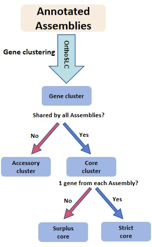

# Readme OrthoSLC (1.0.0)

**Apologies and Warnings:** results generated by versions prior to 0.2.0 had incorrect sequence to ID correspondence. Sincere apologies.

**OrthoSLC** is a pipline that performs Reciprocal Best Blast Hit (RBBH) Single Linkage Clustering (V1.0.0 onwards allows [mcl](https://github.com/micans/mcl)) to obtain Orthologous Genes, and generate core and accessory genes as final output. <br>

**OrthoSLC ToolKit (OthoSLC_TK, at bottom of this page)**: From V1.0.0 onwards, we provide `OthoSLC_TK` to assist some downstream related tasks like MSA, construction of single copy core genome, calculating all pairwise SNP count.

`OrthoSLC` is: <br>
* lightweight, 
* fast: 
  * 90 *E.coli* annotated genomes, 10 threads to final cluster -> <150 s;
  * 976 *E.coli* annotated genomes (unique genes -> ~500M), 30 threads -> ~22 min;
  * 1200 *E.coli* annotated genomes (highly diverse, from six different lineages, unique genes -> ~900M), 30 threads -> ~70 min;
  * 3050 *E.coli* annotated genomes (from different lineages, unique genes -> 1.2G), 30 threads -> ~220 min, peak memory < 15G with speed trade off; 
* convenient to install;
* and **independent** of relational database management systems (e.g., MySQL, Redis, SQLite)

**Download:**<br>
```Shell
$ git clone https://github.com/JJChenCharly/OrthoSLC
$ cd OrthoSLC
```

**Caveat:**<br>
- The pipeline is currently available for linux-like system only.
- From V1.0.0 onwards, the "all-in-one" Jupyter notebook interface `OrthoSLC_Python_jupyter_interface.ipynb` no longer gurantee same output as excutable binaries. Users should employ excutable in `bins/`

**Requirement and Run:**<br>
* Python3 (suggest newest stable release or > V3.7)<br>
* C++17 ("must" or higher for compiling) users may also directly use pre-compiled binary files by allowing excute access:<br>
* [NCBI Blast+](https://ftp.ncbi.nlm.nih.gov/blast/executables/blast+/LATEST/) (suggest 2.12 or higher) <br>
* `mcl` (optional but Highly suggested, `apt-get install mcl`)

You may use pre-compiled:
```Shell
$ cd OrthoSLC
$ chmod a+x bins/*
```
Or use `install.sh` to compile like following:
```Shell
$ cd OrthoSLC
$ chmod a+x install.sh
$ ./install.sh src/ bins/
```

# Easy Run
The pipeline **start with annotated genomes**, and can **produce clusters of gene id, and FASTA files of each cluster**.

Therefore, with: 
- `blastn` and `mcl` in `$PATH`;
- one fasta file for each strain, many DNA sequences in each fasta;

you can easily try:
* 90 *E.coli* genomes and 10 threads (time: <150s).
```Shell
bash ./commandline_template.sh ./bins \
./test_output \ # your output directory
./test_inputs \ # your input directory
10 \ # threads
60 \ # larger -> lower mem but a bit slower
fasta # input file format
```

* ~3000 *E.coli* genomes (from six lineages, unique genes -> 1.2G) on 30 threads:<br>
(Intel(R) Xeon(R) Platinum 8352V CPU @ 2.10GHz, time: ~215 min, peak mem <15G). Peak mem can be reduced to <5G with ~10 min more total time usage, by increasing `500` to more.
```Shell
bash ./commandline_template.sh ./bins \
./test_output \
./test_inputs \
30 \
500 \
ffn
```

Note that, this pipeline is recommended for sub-species level single copy core genome construction since RBBH may not work well for missions like finding Human-Microbe orthologs.

The programs uses [A simple C++ Thread Pool implementation](https://github.com/progschj/ThreadPool), and sincere thanks to [its contributors](https://github.com/progschj/ThreadPool/graphs/contributors).

Bug report: 
* <jingjie.chencharly@gmail.com>

# You can run each step independently (check `commandline_template.sh`):

## Step 1 Annotate Genome information preparation
The pipeline starts with annotated genomes in fasta format (accept DNA as default input).<br> 
Step 1 needs the **path to directory of annotated FASTA files** as input, your input folder should have Prokka/PGAP output structures:
```Shell
$ tree ./test_inputs
./test_inputs
├── strain_A
│   ├── strain_A.err
│   ├── strain_A.faa
│   ├── strain_A.ffn
│   ├── strain_A.fna
...
├── strain_B
│   ├── strain_B.err
│   ├── strain_B.faa
│   ├── strain_B.ffn
...
```
Or simple layout:
```Shell
$ tree ./test_inputs
./test_inputs
├── K12_MG1655.fasta
├── UTI89.fasta
├── strain_A.fasta
├── strain_B.fasta
```

By `-f`, program looks for all files with given extension. Program generates a header-less, tab separated table, in which the 
* first column is a short ID (`strainID-GeneID`);
* second column is the strain name (file name or parent folder name), 
* third column as the absolute path. 

```shell
$ python3 ./bins/Step1_preWalk.py -h
Usage: python Step1_preWalk.py -i input/ -o output/ [options...]

  -i or --input_path ---> <dir> path/to/input/directory
  -o or --output_path --> <txt> path/to/output_file
  -f or --format -------> <str> file extension to look for (e.g. 'sqn', 'ffn')
  -h or --help ---------> display this information
 ```

## Step 2 FASTA dereplication
Step 2 is to remove sequence duplication within each genome (e.g., copies of tRNA, some CDS). This dereplication is equivalent to 100% clustering, to obtain single copy.<br>
Step 2 **requires the tab separated table output by Step 1 as input**, and specifying a directory (`-o`) for dereplicated files.<br>
Since, `V1.0.0`, by specifying `-c or --copy_info_path`, program will organize ID of copies (identical sequences), and output file is a tsv where one row is one set of identical copies separated by `\t`.<br>
Note! Dereplication of OrthoSLC in Step 2 here is to simply record indentical sequences, not by region coverage of reads. Hence, annotated results of a complete circular or near complete genome assembly is suggested. What I usually do is leting [TellSeq](https://universalsequencing.com/pages/tell-seq-technology) handle my genome extract. I always obtain N<sub>50</sub>>4.5Mbp *E.coli* assembly (not complete) with 300 to 350 RMB/sample (~<50$).

```Shell
$ python3 ./bins/Step2_simple_derep -h
Usage: Step2_simple_derep -i input_file -o output/ [options...]

  -i or --input_path ------> <txt> path/to/file/output/by/Step1
  -o or --output_path -----> <dir> path/to/output/directory
  -c or --copy_info_path --> <txt> path/to/output/copy_info.txt
  -u or --thread_number ---> <int> thread number, default: 1
  -h or --help ------------> display this information
 ```
 
### <font color="red">Note before next step</font>
After dereplication, users should give a careful check of **size** of dereplicated FASTA files. It is worth noting that if a FASTA file with a very low amount of sequences, getting processed together with all the rest, the final "core" clusters will be heavily affected and may bias your analysis.
 
```Shell
grep -c ">" $wd/S2_op_dereped/* | sort -t: -k2rn
```

Since the core genome construction is similar with intersection construction. <font color="red">**It is recommend to remove some very small dereplicated fasta files BEFORE NEXT STEP**</font>, e.g., remove all dereplicated <i>E.coli </i> genomes with file size lower than 2.5MB as most should be larger than 4 MB.
    
## Step 3 Pre-clustering of using all dereplicated FASTAs and non-redundant genome generation

This step performs 100% clustering on all dereplicated FASTAs generated in Step 2 to further dereplicate on all sequences.<br>

The program of Step 3 will take the **dereplicated fasta files made in step 2 as input**, and produce:<br>
* Fasta dereplicate on all sequences for reciprocal blast query
* length of each non-redundant sequence
* pre-clustered results (one row one cluster tab separated format)
* each genome that is redundancy-removed for `makeblastdb`
* gene id information: a tab delimited table, first column as short id generated, second colums as description line of original fasta 

You may run `Step3_pre_cluster` like following:

```Shell
Usage: Step3_pre_cluster -i concatenated.fasta -d dereped/ -n nr_genome/ -l seq_len.txt -p pre_cluster.txt [options...]

  -i or --input_path -----> <dir> path/to/directory of dereplicated FASTA from Step2
  -d or --derep_fasta ----> <fasta> path/to/output/dereplicated concatenated FASTA
  -n or --nr_genomes -----> <dir> path/to/directory/of/output/non-reundant/genomes
  -l or --seq_len_info ---> <txt> path/to/output/sequence_length_table
  -m or --id_info --------> <txt> path/to/output/id_info_table
  -p or --pre_cluster ----> <txt> path/to/output/pre_clustered_file
  -u or --thread_number --> <int> thread number, default: 1
  -h or --help -----------> display this information
```
    
## Step 4 Reciprocal Blast

Step 4 will carry out the Reciprocal Blast using [NCBI Blast](https://ftp.ncbi.nlm.nih.gov/blast/executables/blast+/LATEST/).
 
The pipeline will assist you to:<br>
1. Create blast db with non-redundant genomes using `makeblastdb`.
2. Using `blastn` or `blastp` to align the `dereplicated concatenated FASTA` against each of the db just made and get tabular output.

In case you have installed your blast but not exported to `$PATH`, you need to provide path to your blast binary file. You may use  `whereis blastn` or `whereis makeblastdb` in order to get the full path to your blast binary file.<br>

### makeblastdb
To create database to BLAST, users should provide **path to directory where all non-redundant FASTA made in Step 4 is**, and a **path to output directory where BLAST database is to store**.<br>
You may run `Step4_makeblastdb.py` like following:

```Shell
Usage: python Step4_makeblastdb.py -i input/ -o output/ [options...]

options:

  -i or --input_path -----------> <dir> path/to/input/directory of nr_genomes from Step 2
  -o or --output_path ----------> <dir> path/to/output/directory
  -c or --path_to_makeblastdb --> <cmd_path> path/to/makeblastdb, default: makeblastdb
  -u or --thread_number --------> <int> thread number, default: 1
  -t or --dbtype ---------------> <str> -dbtype <String, 'nucl', 'prot'>, default: nucl
  -h or --help -----------------> display this information
 ```
 
### Reciprocal Blast
To perform reciprocal BLAST, users should provide **path to dereplicated concatenated FASTA producd by step 3**, **path to directory where databases made by `makeblastdb`**, and a **path to output directory where BLAST tabular output** is to store.<br>
This step assist you to achieve all-vs-all Blast with task distribution and automatic thread allocation, which extenuate memory usage and increase the overall speed.
 
You can run `Step4_reciprocal_blast.py` like following:

```Shell
Usage: python Step4_reciprocal_blast.py -i query.fasta -o output/ -d directory_of_dbs/ [options...]

options:

  -i or --query -------------> <fasta> path/to/dereped_cated.fasta from Step 3
  -d or --dir_to_dbs --------> <dir> path/to/directory/of/dbs by makeblastdb
  -o or --output_path -------> <dir> path/to/output/directory
  -c or --path_to_blast -----> <cmd_path> path/to/blastn or blastp, default: 'blastn'
  -e or --e_value -----------> <float> blast E value, default: 1e-5
  -s or --strand ------------> <str> select from <'both', 'minus', 'plus'>, default: plus
  -u or --blast_thread_num --> <int> blast thread number, default: 1
  -f or --outfmt ------------> <str> specify blast output format if needed, unspecified means `'6 qseqid sseqid pident score evalue'` as default
  -t or --blastp_task  ------> <str> select from <'blastp' 'blastp-fast' 'blastp-short'>, unspecified means `'blastp'` as default
  -T or --blastn_task  ------> <str> select from <'blastn' 'blastn-short' 'dc-megablast' 'megablast' 'rmblastn' >, unspecified means `'megablast'` as default
  -h or --help --------------> display this information
```
    
## Step 5 query binning
This step is to apply hash binning to bin all presence of a query into same file to facilitate next step filtering.

You can run `Step5_query_binning` like following:

```Shell
Usage: Step5_query_binning -i input/ -o output/ [options...]

  -i or --input_path -----> <dir> path/to/input/directory of blast outputs
  -o or --output_path ----> <dir> path/to/output/directory
  -u or --thread_number --> <int> thread number, default: 1
  -L or --bin_level ------> <int> binning level, an intger 0 < L <= 9999, default: 10
  -k or --no_lock_mode ---> <on/off> select to turn no lock mode <on> or <off>, default: off
  -h or --help -----------> display this information
```

<font color="red"><b>Set bin level:</b></font><br>
According to the amount of genomes to analysze, user should provide binning level, which is to set how many bins should be used. Level $L$ should be interger within range $0 < L \le 9999$, and will generate $L$ bins. 

Suggestion is that do not set the bin level too high, especially when less than 200 genomes participated. If such amount of genomes participated analysis, bin level from 10 to 100 should work as most efficient way. 

As tested, an analysis of 30 genomes, has 30 BLAST output after step 4. 
* A bin level of 10, takes 7 seconds to finish, 
* a bin level of 100, takes 10 seconds to finish,
* a bin level of 1000, takes 24 seconds to finish,

<font color="red"><b>When to set a high bin level:</b></font><br>
Simply speaking, when you have really larger amount of genomes and not enough memory (e.g., more than 1000 genomes and less than 10 GB memory), increase `-L`to 200 ~ 300. <br>

For example, if the output of BLAST for 1000 genomes reach 15 GB in size, and if the bin level is set to 10, there will be 10 bins to evenly distribute the data. On average, each bin will contain 1.5 GB of data, which may be too memory-intensive to process in step 6 (where requires approximately 1.5 GB of memory per bin). However, if the number of bins is increased to 1000, the size of each bin will be reduced to between 100-200 MB, it will then facilitate step 6 parallelization.

<font color="red"><b>No lock mode:</b></font><br>
we provide **no lock mode** in all steps that we applied hash binning to speed up the process. We allow users to turn off mutex lock which is to safely write into files when multi-threading. In ours tests, program can generate files without data corruption when multi-threading with no lock (data corruption were rarely observed, the possiblity of data corruption may vary between computation platform).
    
## Step 6 Filtering and binning
This step is to filter the blast output and to apply hash binning, to prepare for reciprocal best finding.<br>

Step 6 requires **path to directory of query binning output (Step 5)**, **sequence length information, pre-cluster information output by Step 3** as input.

You can run `Step6_filter_n_bin` like following:

```Shell
Usage: Step6_filter_n_bin -i input/ -o output/ -s seq_len_info.txt [options...]

  -i or --input_path --------> <dir> path/to/input/directory from Step 5
  -o or --output_path -------> <dir> path/to/output/directory
  -s or --seq_len_path ------> <txt> path/to/seq_len_info.txt from Step 3
  -p or --pre_cluster_path --> <txt> path/to/pre_cluster.txt from Step 3
  -L or --bin_level ---------> <int> binning level, an intger 0 < L <= 9999 , default: 10
  -r or --length_limit ------> <float> length difference limit, 0 < r <= 1, default: 0.8
  -m or --similarity_limit --> <float> similarity limit, 0 < r <= 100, default: 80
  -w or --weight ------------> <str> select from <'none', 'pident', 'bitscore', 'evalue'> for clustering,
  -k or --no_lock_mode ------> <on/off> select to turn no lock mode <on> or <off>, default: off
  -u or --thread_number -----> <int> thread number, default: 1
  -h or --help --------------> display this information
```

The pipeline will carry out following treatment to BLAST output:
  1. Paralog removal: <br>
  If query and subject is from same strain, the hit will be skipped, as to remove paralog.
  2. Length ratio filtering:<br>
  Within a hit, query length $Q$ and subject length $S$, the ratio $v$ of this 2 length

  $$v = \frac{Q}{S}$$

  should be within a range, according to [L. Salichos et al](https://journals.plos.org/plosone/article?id=10.1371/journal.pone.0018755), $r (0 < r \le 1)$ is recommended to be higher than 0.3 which means the shorter sequence should not be shorter than 30% of the longer sequence:

  $$r \le v \le \frac{1}{r}$$

  If above condition not met, the hit will be removed from analysis.

  3. Similarity filtering: Keep only pairs with `pident` > `-m`.
  4. Non-best-hit removal: <br>
  * Identical sequences are always regarded as best hit.
  * If a query has more than 1 subject hits, only the query-subject pair with highest score will then be kept.
  * if pairs are of same score, the pair whose query and subject are of more similar length will be kept.
  5. Sorting and binning:<br>
  For every kept hit, its query and subject will be sorted using Python or C++ built in sort algorithm. This is because in a sequential blast output file, only "<b>single direction best hit</b>" can be obtained, its "<b>reciprocal best hit</b>" only exist in other files, which poses difficulty doing "<b>repriprocal finding</b>". <br>
  However, if a query $a$ and its best suject hit $b$, passed filter above, and form $(a, b)$, and in the mean time we sort its rericprocal hit $(b, a)$ from another file into $(a, b)$, then both $(a, b)$ will generate same hash value. This hashed value with last several digits will allow us to bin them into same new file. Therefore, after this binning, "<b>reciprocal finding</b>" will be turned into "<b>duplication finding</b>" within one same file.<br>
  6. In `Step4_reciprocal_blast.py`, program by defaul generates `qseqid sseqid pident score evalue` as output columns. By `-w`, you may choose 'none' or one of 'pident', 'bitscore', 'evalue' to keep for `mcl` clustering weight. If you would like to employ `Step8_SLC` for clustering, you have to select 'none'.

<font color="red"><b>Set bin level:</b></font><br>
According to the amount of genomes to analysze, user should provide binning level, which is to set how many bins should be used. Level $L$ should be interger within range $0 < L \le 9999$, and will generate $L$ bins. 
    
## Step 7 Reciprocal Best find
This Step is to find reciprocal best hits. In `Step 6`, query-subject pairs had been binned into different files according to their hash value, therefore, pair $(a, b)$ and its reciprocal pair $(b, a)$ (which will be sorted into $(a, b)$ ), will be in the same bin. Thus, a pair found twice in a bin will be reported as a reciprocal best blast pair.

In addition, Step 7 also does hash binning after a reciprocal best hit is confirmed. Query-subject pairs will be binned by the hash value of query ID, which then put pairs with common elements into same bin to assist faster clustering in next step.

Step 7 requires **path to directory of bins output by Step 6**, and path to output directory.

You can run `Step7_RBF` like following:

```Shell
Usage: Step7_RBF -i input/ -o output/ [options...]

  -i or --input_path -----> <dir> path/to/input/directory from Step 6
  -o or --output_path ----> <dir> path/to/output/directory
  -u or --thread_number --> <int> thread number, default: 1
  -k or --no_lock_mode ---> <on/off> select to turn no lock mode <on> or <off>, default: off
  -L or --bin_level ------> <int> binning level, an intger 0 < L <= 9999 , default: 10
  -h or --help -----------> display this information
```

<font color="red"><b>Set bin level:</b></font><br>
According to the amount of genomes to analysze, user should provide binning level, which is to set how many bins should be used. Level $0 < L \le 9999$, and will generate $L$ bins. 
    
## Step 8 Clustering
### optoin 1: Single Linkage Clustering (select `-w 'none'` in Step 6)
This step will carry out single linkage clustering on output from step 7. Users may perform "<b>multi-step-to-final</b>" or "<b>one-step-to-final</b>" clustering by adjusting the `compression_size` parameter. In the output files, each row is a cluster (stopped by "\n") and each gene ID is separated by "\t".

In case that large amount genomes participated analysis, it could be memory intensive to reach final cluster in a single step. The pipeline provide alternative to extenuate such pressure by reaching final cluster with multiple steps. For example, if `compression_size` = 5 is provided, program will perform clustering using 5 files at a time and shrink the output file number by a factor of 5.

<font color="red"><b>Note Before Start</b></font><br>
User <font color="red"><b>must</b></font> specify the path to `pre-cluster file` produced in `Step 3`, when running the <font color="red"><b>LAST step of multi step to final</b></font>, or when running direct <font color="red"><b>one step to final</b></font>.

You can run `Step8_SLC` like following:

```Shell
Usage: Step8_SLC -i input/ -o output/ [options...]

options:
  -i or --input_path --------> <dir> path/to/input/directory from Step 7
  -o or --output_path -------> <dir> path/to/output/directory
  -u or --thread_number -----> <int> thread number, default: 1
  -p or --pre_cluster_path --> <txt> path/to/output/pre_clustered file from Step 3
  -S or --compression_size --> <int> compression size, default: 10, 'all' means one-step-to-final
  -h or --help --------------> display this information
```

Example running with `multi-step-to-final` approach:

E.g., there are 1,000 files generated by Step 8<br>
Set `-S or --compression_size` to 1
```Shell
bin_dir="bin_dirctory"
wd="working_dir"

time $bin_dir/Step8_SLC \
-i $wd"/S8_op" \
-o $wd"/SLC_1" \
-u 16 \
-S 1
```
above commands will perform clustering on every 1 file, and generate 1,000 files in `$cp"/SLC_1"`.

Set `-S or --compression_size` to 5
```Shell
time $bin_dir/Step8_SLC \
-i $wd"/SLC_1" \
-o $wd"/SLC_2" \
-u 16 \
-S 5
```
it will perform clustering on every 5 files, and generate 200 files in `$cp"/SLC_2"`.


Set `-S or --compression_size` to 10
```Shell
time $bin_dir/Step8_SLC \
-i $cp"/SLC_2" \
-o $cp"/SLC_3" \
-u 16 \
-S 10
```
it will perform clustering on every 10 files, and generate 20 files in `$cp"/SLC_3`.

Finally, Set `-S or --compression_size` as `all`, and provide `pre_cluster.txt` made in Step 4 using `-p or --pre_cluster_path`
```Shell
time $bin_dir/Step8_SLC \
-i $cp"/SLC_3" \
-o $cp"/Final_cluster" \
-p $cp"/S3_op_pre_cluster.txt" \
-u 16 \
-S all
```
it will perform clustering on on all, and give the final 1 cluster file in `$cp"/Final_cluster`.

### option 2: MCL
You can run `Step8_SLC` like following:

```Shell
optional arguments:
  -h, --help            show this help message and exit
  -c , --path_to_mcl    <cmd_path> path/to/mcl
  -i , --input_path     <dir> path/to/input/directory from Step 7
  -o , --output_path    <dir> path/to/output/directory
  -p , --pre_cluster_path
                        <txt> path/to/pre_cluster.txt from Step 3
  -u , --mcl_thread_num
                        <int> number of threads for mcl
```

This step concatenate all files of Step 7 output and feed to mcl by `stdin`, and fuse the pre-cluster result with `mcl` output.<br>
you may also provide any other argument that `mcl` has like
```Shell
time python3 ./bins/Step8_MCL.py \
-c mcl \
-i $wd"/S7_op" \
-p $wd"/S3_op_pre_cluster.txt" \
-o $wd"/Final_cluster" \
-u 16 \
-I 1.5 --abc # mcl args
```
    
## Step 9 Write clusters into FASTA
In Step 9, program will help user to generate FASTA file for each cluster. By providing the final one cluster file generated by Step 8 as input, program produces 3 types of clusters into 3 directories separately.<br>

Noteably, those genomes 
* depreplicated in **Step 2**,  
* not removed because of too low genome size
* participated processes up to this step, 

```Shell
find ./test_op/S2_op_dereped/ -type f | wc -l
```

are used to separate 3 types of clusters.<br>

1. In drectory `accessory_cluster`(a cluster not shared by all genomes), FASTA files of clusters which **do not have genes from all genomes** participated analysis, will be output in this drectory. For example, there are 100 genomes in analysis, a cluster with less than 100 genes will have its FASTA output here. Also, if a cluster has >= 100 genes, but all these genes are from less than 100 genomes, its FASTA will be in this directory.
2. In drectory `strict_core`, a give cluster with **exactly 1 gene from every genome** analyzed. Such clusters will have their FASTA files here.
3. In drectory `surplus_core`, a give cluster with **at least 1 gene from every genome** analyzed, and **some genomes has more than 1 genes** in this cluster. Such clusters will have their FASTA files here.



This step also requires the concatenated FASTA made in Step 3 as input.

You may run `Step9_write_clusters` like this:

```Shell
Usage: Step9_write_clusters -i input_path -o output/ -f concatenated.fasta [options...]

options:
  -i or --input_path --------> <dir> path/to/input/final_cluster_file from Step 8
  -o or --output_path -------> <dir> path/to/output/directory
  -f or --fasta_path --------> <fasta> path/to/dereped_cated_fasta from Step 3
  -m or --id_info_path ------> <txt> path/to/output/id_info_table from Step 3
  -p or --pre_cluster_path --> <txt> path/to/pre_clustered_file from Step 3
  -c or --total_count -------> <int> amonut of genomes to analyze
  -a or --pct_threshold -----> <float> only write accessory clusters shared by >=n% (0<=n<100) of genomes, default: 0
  -t or --cluster_type ------> <txt> select from < accessory / strict / surplus >, separate by ',', all types if not specified
  -u or --thread_number -----> <int> thread number, default: 1
  -h or --help --------------> display this information
```

# OrthoSLC ToolKit (OthoSLC_TK)
To run `OthoSLC_TK`, you may need:
* [`Biopython`](https://pypi.org/project/biopython/)
* [`Pandas`](https://pypi.org/project/pandas/)
* [`kalign`](https://github.com/timolassmann/kalign) (accept only V3.3.4)
* [`mafft`](https://mafft.cbrc.jp/alignment/software/)

`OthoSLC_TK` assists you to:
- Do MSA within each cluster;
- Concatenate aligned clusters into single copy core genome (as `phy` or other format) so you can do [RAxML](https://github.com/stamatak/standard-RAxML), or [IQ-TREE](https://iqtree.github.io/) or whatever;
- Generate SNP count of core genome between all pairwise of strains;

## What I do:
### I align each strict core cluster:
```Shell
kalign_bin='Path/to/kalign' 
python3 ./bins/TK_kalign.py \
-c $kalign_bin \
-i ./test_output/S9_write_fasta/strict_core/ \
-o path/to/kalign_op \
-u 10 --type dna
```
or:
```Shell
mafft_bin='Path/to/mafft' 
python3 ./bins/TK_mafft.py \
-c $mafft_bin \
-i ./test_output/S9_write_fasta/strict_core/ \
-o path/to/mafft_op \
-u 10 --maxiterate 1000
```

### I concatenate aligned clusters into single copy core genome. 
The output has each piece of fasta with original strain name.
```Shell
python3 ./bins/TK_AlnConcat.py \
-i path/to/kalign \
-o path/to/BUG_core.phy \
-T ./test_output/Step1_op.txt \
-f phylip-relaxed
```

Now `path/to/BUG_core.phy` is ready for [RAxML](https://github.com/stamatak/standard-RAxML), or [IQ-TREE](https://iqtree.github.io/)!

### I calculate SNP count all pairwise:
```Shell
python3 ./bins/TK_SNPmat.py \
-i path/to/kalign \
-o path/to/snp_count.csv \
-T ./test_output/Step1_op.txt \
-u 10
```
